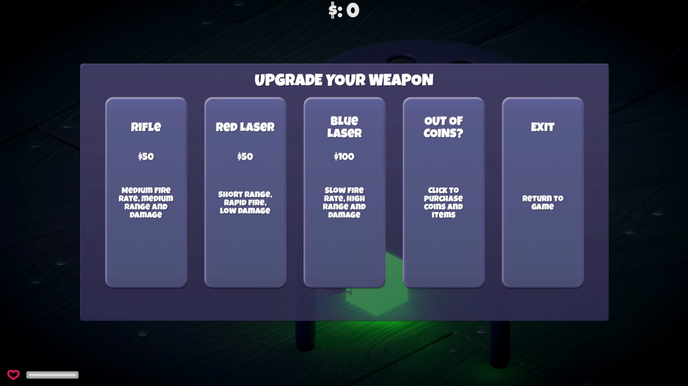
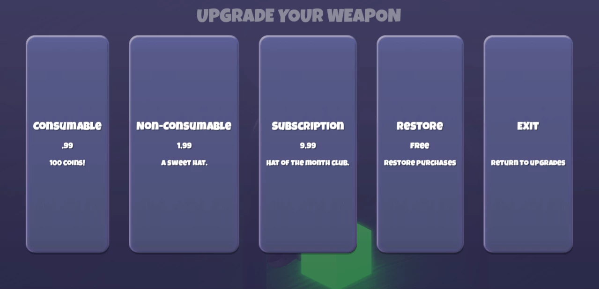
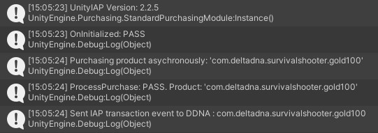

# tutorial-unity-iap #
 This tutorial demonstrates how to record and send **transaction** events to DeltaDNA when the player makes an In App Purchase. The **transaction** event is a default event that appears on all deltaDNA games, it populates revenue reporting and spender segmentation, it supports currency conversion and receipt validation. 
 
 Further Information: 
 * [Revenue Tracking](https://github.com/deltaDNA/unity-sdk#tracking-revenue) 
 * [DeltaDNA Unity SDK](https://docs.deltadna.com/advanced-integration/unity-sdk/#transaction)
 
 The tutorial builds on the existing [Unity IAP Tutorial](https://learn.unity.com/tutorial/unity-iap) using the [Unity IAP Plugin](https://docs.unity3d.com/Manual/UnityIAP.html) to smplify In-app purchase integration.


## Contents ##
* [Overview](#Overview)
* [Making an IAP purchase](#Making-an-IAP-purchase)
* [Tutorial Code](#Tutorial-Code)
* [IAP Purchase code](#IAP-Purchase-code)
* [DDNA transaction event code](#DDNA-transaction-event-code)
    * [Confirm IAP Spend](#Confirm-IAP-Spend)
    * [Create Products Spent and Received objects](#Create-ProductsSpent-and-ProductsReceived-objects)
    * [Build the **transaction** event](#Build-the-transaction-event)
    * [Add transaction receipt details](#Add-transaction-receipt-details)
    * [Record the **transaction** event](#Record-the-transaction-event)
* [Validation, Reporting and Analysis](#Validation,-Reporting-and-Analysis)


## Overview ##
This tutorial extends the existing [Unity IAP Tutorial](https://learn.unity.com/tutorial/unity-iap) as follows:

* By adding the [deltDNA Unity SDK](https://docs.deltadna.com/advanced-integration/unity-sdk/), then starting it, to enable the recording of basic **newPlayer**, **gameStarted** and **clientDevice** events automatically. Adding the DeltaDNA SDK to a game isn't covered in detail here, more information can be found in the [DeltaDNA SDK Documentation](https://docs.deltadna.com/advanced-integration/unity-sdk), this [Readme](https://github.com/deltaDNA/unity-sdk) and [Video](https://docs.deltadna.com/quick-start-integration/quick-integration-video/) 

* By adding some code to the purchase processor response from the Unity IAP Plugin to send a transaction event when the player purchases a specific **consumbable** item.

* By populating the **transaction** event parameters with values from the Unity Product object provided in the purchase response, including store receipt contents required for receipt validation. 


## Making an IAP purchase ##

To make a purchase, run the tutorial and navigate your player to the Green glowing cube positioned below the stool, or press 'Esc' to enter the Pause menu and click the 'Store' button.


The player is then presented with the weapon shop. If the player doesn’t have enough in-game currency to purchase the weapon they want, there is a button labelled ‘OUT OF COINS?’ which the player can click to open the IAP panel.



In the IAP panel they have a choice of various IAP products, including a Consumable to purchase 100 coins for .99 cents.



Clicking the Consumable button will initiate an in-App purchase that, if successfull, will credit the player with 100 coins to spend on weapons. Debug info from the purchase will be displayed in the Unity Console.



## Tutorial code
The code to start the deltaDNA SDK and record a **transaction** event is in the ```Assets\IAPDemo\Scripts\transaction_tutorial.cs``` script file that has been added to the **DDNA-Tutorial** obect in the **Level01 5.x IAP** scene. 


## IAP Purchase code
The ```\Assets\IAPDemo\Purchaser.cs``` file contains a ```Purchase``` class that handles all the IAP processing for the original Unity IAP Tutorial. When the player makes a purchase, the ```ProcessPurchase``` method is called with arguements containing the product information required to populate the **transaction** event. 

To avoid cluttering up this existing ```Purchase``` class a method is called in our own tutorial code when the player player makes a successful purchase. 

We do this by creating a GameObject to reference our tutorial code from within the ```Purchase``` class.
```csharp
// Game Object that holds our DeltaDNA analytics tutorial script
private GameObject ddnaTutorial; 
```
and grabbing a referene to it in the ```Purchase``` class ```Start``` method
```csharp
// Find deltaDNA Analytics Tutorial code 
ddnaTutorial = GameObject.Find("DDNA-Tutorial");
```

We can then simply call our ```RecordIapTransaction``` method when the ```ProcessPurchase``` method is called as a result of the player purchasing a consumable IAP.
```csharp
public PurchaseProcessingResult ProcessPurchase(PurchaseEventArgs args)
{
    // A consumable product has been purchased by this user.
    if (String.Equals(args.purchasedProduct.definition.id, kProductIDConsumable, StringComparison.Ordinal))
    {
        Debug.Log(string.Format("ProcessPurchase: PASS. Product: '{0}'", args.purchasedProduct.definition.id));
        // The consumable item has been successfully purchased, add 100 coins to the player's in-game score.
        ScoreManager.score += 100;

        // Record a DDNA transaction event if we found the DDNA tutorial code.
        if (ddnaTutorial != null)
        {
            ddnaTutorial.GetComponent<transaction_tutorial>().RecordIapTransaction(args.purchasedProduct);                    
        }

    }
    ...
```

## DDNA transaction event code ##
The DeltaDNA **transaction** is a complex event with many parameters, some of which are required for it to pass event validation. There are some helper functions in the DelatDNA SDK to simplify the creation of **transaction** events, we will use some of them, rather than populate the ```GameEvent``` a parameter at a time.

The complete code for the method that records the **transaction** event, based on the UnityIAP Product passed to it, is as follows.

We will step through it and explain each section in detail. 
```csharp
    public void RecordIapTransaction(UnityEngine.Purchasing.Product iap)
    {                     
        // Check that we have a revenue amount to record.
        if (!string.IsNullOrEmpty(iap.metadata.isoCurrencyCode)  && iap.metadata.localizedPrice > 0 )
        {
            // Add the Cost of the IAP to a productsSpent object
            var productsSpent = new DeltaDNA.Product()
                .SetRealCurrency(
                    iap.metadata.isoCurrencyCode, 
                    Product.ConvertCurrency(iap.metadata.isoCurrencyCode,iap.metadata.localizedPrice
                    )
            );

            // Add the items or currency received to a productsReceived object
            // We have cheated by hardwiring this for this tutorial!
            // Note that the virtualCurrencyType should be one of these 3 values ["PREMIUM","PREMIUM_GRIND","GRIND"]
            var productsReceived = new DeltaDNA.Product()
                .AddVirtualCurrency("Coins", "PREMIUM", 100);

            // Create a transaction using the products spent and received objects 
            // Note that the transaction type should always be "PURCHASE" for IAPs
            var transactionEvent = new Transaction(
                iap.metadata.localizedTitle,
                "PURCHASE",
                productsReceived,
                productsSpent)
                .SetTransactionId(iap.transactionID)
                .AddParam("productID",iap.definition.id);
            
            // Add the transaction receipt if we have one.
            if(iap.hasReceipt)
            {
                // Populate transaction receipt fields dependig on type of receipt
                // https://github.com/deltaDNA/unity-sdk#tracking-revenue
                // https://docs.unity3d.com/Manual/UnityIAPPurchaseReceipts.html 
                
                TransactionReceipt transactionReceipt = new TransactionReceipt();
                transactionReceipt = JsonUtility.FromJson<TransactionReceipt>(iap.receipt);

                if(transactionReceipt.Store == "AppleAppStore")
                {
                    transactionEvent.SetServer("APPLE");
                    transactionEvent.SetReceipt(transactionReceipt.Payload.ToString());
                }
                else if (transactionReceipt.Store == "GooglePlay")
                {
                    GooglePlayReceipt googleReceipt = new GooglePlayReceipt();
                    googleReceipt = JsonUtility.FromJson<GooglePlayReceipt>(transactionReceipt.Payload);

                    transactionEvent.SetServer("GOOGLE");
                    transactionEvent.SetReceipt(googleReceipt.json);
                    transactionEvent.SetReceiptSignature(googleReceipt.signature);
                }             
            }

            // Record the transaction event
            DDNA.Instance.RecordEvent(transactionEvent);
            Debug.Log(string.Format("Sent IAP transaction event to DDNA : {0}", iap.definition.id));
        }
    }
```

So, lets look at that in a bit more detail.

### Confirm IAP Spend ####
Before building the **transaction** event, we quickly validate that we have a currency type and amount for the IAP. In this game it shouldn't be possible to make an IAP without these.
```csharp
        if (!string.IsNullOrEmpty(iap.metadata.isoCurrencyCode)  && iap.metadata.localizedPrice > 0 )
```

### Create ProductsSpent and ProductsReceived objects ###
The **transaction** and several other deltaDNA events make use of special ```Product``` objects. When the event processor sees these it performs additional data processing and enrichment on the data. A ```Product``` object can contain an array of ```items```, ```virtualCurrencies``` or a ```realCurrency```. The **transaction** event contains a ```productsSpent``` and a ```productsReceived``` object making it possible to record transactions where the player spends or receives any combination of real or virtual currencies and items. The **transaction** is a very generic, but powerful event.

In this scenario:
* ```productsSpent``` contains the type and amount of real currency spent by the player, $0.99 USD. 
* ```productsReceived``` contains the type and amount of virtual currency the player received, 100 Coins

```csharp
            // Add the Cost of the IAP to a productsSpent object
            var productsSpent = new DeltaDNA.Product()
                .SetRealCurrency(
                    iap.metadata.isoCurrencyCode, 
                    Product.ConvertCurrency(iap.metadata.isoCurrencyCode,iap.metadata.localizedPrice
                    )
            );

            // Add the items or currency received to a productsReceived object
            // We have cheated by hardwiring this for this tutorial!
            // Note that the virtualCurrencyType should be one of these 3 values ["PREMIUM","PREMIUM_GRIND","GRIND"]
            var productsReceived = new DeltaDNA.Product()
                .AddVirtualCurrency("Coins", "PREMIUM", 100);
```

Note, the ```realCurrencyAmount``` isn't populated directly from the IAP currency amount, a ConvertCurrency helper method from the Product class is used to ensure that value is correctly represented as an Integer. This is because not all ISO-4217 currencies will contain two units of currency after the decimal point (e.g. VND, JPY ...)

### Build the **transaction** event ###
The ```Transaction``` helper class can now be used to construct the **transaction** event
```csharp
            // Create a transaction using the products spent and received objects 
            // Note that the transaction type should always be "PURCHASE" for IAPs
            var transactionEvent = new Transaction(
                iap.metadata.localizedTitle,
                "PURCHASE",
                productsReceived,
                productsSpent)
                .SetTransactionId(iap.transactionID)
                .AddParam("productID",iap.definition.id);
```

### Add transaction receipt details ###
If the IAP Product contained receipt fields from the Store, they should be mapped into the relavent parameters on the transaction event, to enable server based receipt validation by deltaDNA and prevent fraudulent transactions from polluting the dataset. The Google Play and Apple Store receipt validation systems have slightly different parameters. 
```csharp
            // Add the transaction receipt if we have one.
            if(iap.hasReceipt)
            {
                // Populate transaction receipt fields dependig on type of receipt
                // https://github.com/deltaDNA/unity-sdk#tracking-revenue
                // https://docs.unity3d.com/Manual/UnityIAPPurchaseReceipts.html 
                
                TransactionReceipt transactionReceipt = new TransactionReceipt();
                transactionReceipt = JsonUtility.FromJson<TransactionReceipt>(iap.receipt);

                if(transactionReceipt.Store == "AppleAppStore")
                {
                    transactionEvent.SetServer("APPLE");
                    transactionEvent.SetReceipt(transactionReceipt.Payload.ToString());
                }
                else if (transactionReceipt.Store == "GooglePlay")
                {
                    GooglePlayReceipt googleReceipt = new GooglePlayReceipt();
                    googleReceipt = JsonUtility.FromJson<GooglePlayReceipt>(transactionReceipt.Payload);

                    transactionEvent.SetServer("GOOGLE");
                    transactionEvent.SetReceipt(googleReceipt.json);
                    transactionEvent.SetReceiptSignature(googleReceipt.signature);
                }             
            }
```
Some simple classes have been created in the tutorial file in order to simplify the parsing of receipt data fields from the JSON provided by the IAP Plugin with the Unity ```JsonUtility.FromJson<>``` helper.
```csharp
// A couple of little classes to simplify transaction receipt parsing from JSON.
[System.Serializable]
public class TransactionReceipt
{
    public string Store;
    public string TransactionID;
    public string Payload;
}
[System.Serializable]
public class GooglePlayReceipt
{
    public string json;
    public string signature;
}
```

### Record the **transaction** event ##
With the **transaction** event built, it can now be recorded by the SDK. This will result in the event being stored to the SDK's local event cache and uploaded in the next scheduled upload, these normally happen at 1 minute intervals. 
```csharp
            // Record the transaction event
            DDNA.Instance.RecordEvent(transactionEvent);
            Debug.Log(string.Format("Sent IAP transaction event to DDNA : {0}", iap.definition.id));
```
### Validation, Reporting and Analysis ###
Once uploaded, the event will be queued for processing and should appear in the [SETUP > Event Browser](https://docs.deltadna.com/reference/setup/qa-events/) tool within 5-15 mins.  You can check if it passed event validation here and drill into the raw data and see the reasons should it fail validation. After that the event will flow into the data warehouse where it will be available to your reporting and analysis tools, this step can take a couple of hours. 

Be sure to take a look at the [Know your Data](https://docs.deltadna.com/reference/analyze/direct-sql-access/#know_your_data) guide. It explains the structure of your data in the warehouse, this is particularly important on transaction events with their special ```Product``` objects, as they will be split accross multiple rows in the ```Events``` database table.
