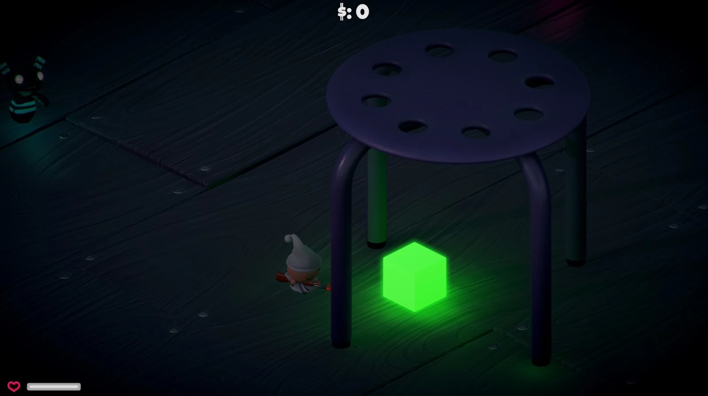

# tutorial-unity-iap #
 This tutorial demonstrates how to record and send **transaction** events to DeltaDNA when the player makes an In App Purchase. The **transaction** event is a default event that appears on all deltaDNA games, it populates revenue reporting and spender segmentation, it supports currency conversion and receipt validation. 
 
 Further Information: 
 * [Revenue Tracking](https://github.com/deltaDNA/unity-sdk#tracking-revenue) 
 * [DeltaDNA Unity SDK](https://docs.deltadna.com/advanced-integration/unity-sdk/#transaction)
 
 The tutorial builds on the [Unity IAP Tutorial](https://learn.unity.com/tutorial/unity-iap) using the existing [Unity IAP Plugin](https://docs.unity3d.com/Manual/UnityIAP.html) to smplify In-app purchase integration.


## Overview ##
This tutorial extends the existing [Unity IAP Tutorial](https://learn.unity.com/tutorial/unity-iap) as follows:

* By adding the [deltDNA Unity SDK](https://docs.deltadna.com/advanced-integration/unity-sdk/), then starting it, to enable the recording of basic **newPlayer**, **gameStarted** and **clientDevice** events automatically. Adding the SDK to a game isn't covered in detail here, more information can be found in the [SDK Documentation](https://docs.deltadna.com/advanced-integration/unity-sdk), this [Readme](https://github.com/deltaDNA/unity-sdk) and this [Video](https://docs.deltadna.com/quick-start-integration/quick-integration-video/) 

* By adding some code to the purchase processor response from the Unity IAP Plugin to send a transaction event when the player purchases a specific **consumbable** item.

* By populating the **transaction** event parameters with values received from the Unity Product object in the purchase response, including store receipt contents required for receipt validation. 


## Making an IAP purchase ##

To make a purchase, run the tutorial and navigate your player to the Green glowing cube positioned below the stool, or press 'Esc' to enter the Pause menu and click the Store button.



The player is then presented with the weapon shop. If the player doesn’t have enough in-game currency to purchase the weapon they want, there is a button labelled ‘OUT OF COINS?’ which the player can click to open the IAP panel.


In the IAP panel they have a choice of various IAP products, including a Consumable to purchase 100 coins for .99 cents.


Clicking the Consumable button will initiate an in-App purchase that, if successfull, will credit the player with 100 coins to spend on weapons. Debug info from the purchase will be displayed in the Unity Console.


## Tutorial code
The code to start the deltaDNA SDK and record a **transaction** event is in the ```Assets\IAPDemo\Scripts\transaction_tutorial.cs``` script file that has been added to the **DDNA-Tutorial** obect in the **Level01 5.x IAP** scene. 


## IAP Purchase code
The ```\Assets\IAPDemo\Purchaser.cs``` file contains a ```Purchase``` class that handles all the IAP processing for the original Unity IAP Tutorial. When the player makes a purchase, the ```ProcessPurchase``` method is called with arguements containing the product information required to populate the **transaction** event. 

To avoid cluttering up this existing ```Purchase``` class a method in our own tutorial code is called, passing the product as an agruement, when the player player makes a successful purchase. 

We do this by creating a GameObject to reference our tutorial.
```
// Game Object that holds our DeltaDNA analytics tutorial script
private GameObject ddnaTutorial; 
```
and grabbing a referene to it in the ```Purchase``` class ```Start``` method
```
// Find deltaDNA Analytics Tutorial code 
ddnaTutorial = GameObject.Find("DDNA-Tutorial");
```

We can then simply call our ```RecordIapTransaction``` method when the ```ProcessPurchase``` method is called as a result of the player purchasing a consumable IAP.
```
public PurchaseProcessingResult ProcessPurchase(PurchaseEventArgs args)
{
    // A consumable product has been purchased by this user.
    if (String.Equals(args.purchasedProduct.definition.id, kProductIDConsumable, StringComparison.Ordinal))
    {
        Debug.Log(string.Format("ProcessPurchase: PASS. Product: '{0}'", args.purchasedProduct.definition.id));
        // The consumable item has been successfully purchased, add 100 coins to the player's in-game score.
        ScoreManager.score += 100;

        // Record a DDNA transaction event if we found the DDNA tutorial code.
        if (ddnaTutorial != null)
        {
            ddnaTutorial.GetComponent<transaction_tutorial>().RecordIapTransaction(args.purchasedProduct);                    
        }

    }
    .
    .
```
